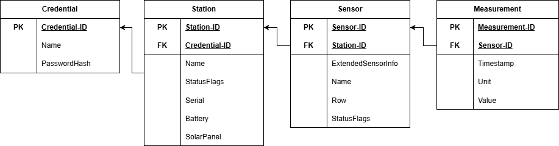
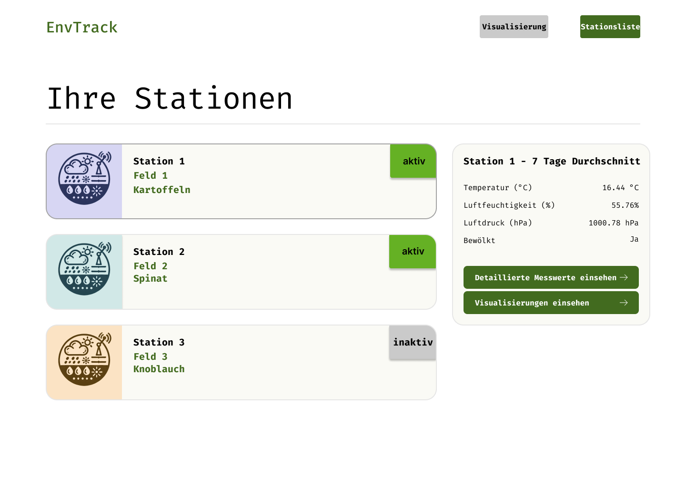
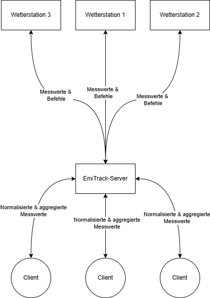

# Pflichtenheft - EnvTrack

## 1. Ausgangssituation

### 1.1

> Das Ziel ist es, eine Wetterstation mit einer WebApp zu entwickeln, welche die Messdaten jener Station visualisiert
> und analysiert.

### 1.2

* Projektleiter: Felix Janetzki
* Projektteam: Herr Lauter, Herr Janetzki
* Auftraggeber: Herr Horst von Quatschkopf

#### _Arbeitsverteilung_

| Arbeitspaket                                                   | Mitarbeiter                 |
|----------------------------------------------------------------|-----------------------------|
| 1.0 Hardwarekonzeption                                         | Herr Lauter                 |
| 1.1 Datenbankkonzeption                                        | Herr Janetzki               |
| 1.2 Konzeption Messdatenauswertung                             | Herr Lauter & Herr Janetzki |
| 1.3 WebAPI-Konzeption                                          | Herr Janetzki               |
| 2.0 Bereitstellung Domäne und DNS                              | Herr Janetzki               |
| 2.1 Bereitstellung Datenbank & WebServer                       | Herr Janetzki               |
| 3.0 Programmierung der Sensortreiber                           | Herr Lauter                 |
| 3.1 Programmierung des Datentransmitters                       | Herr Lauter                 |
| 3.2 Programmierung der Kommunikation der Sensordaten an Server | Herr Lauter                 |
| 3.3 Programmierung Modul für Datenanalyse                      | Herr Lauter & Herr Janetzki |
| 3.4 Programmierung Korrelationsmodul                           | Herr Lauter & Herr Janetzki |
| 4.0 Design des Frontends                                       | Herr Lauter & Herr Janetzki |
| 4.1 Echtzeit-Datendarstellung im Frontend                      | Herr Janetzki               |

### 1.3

#### _Ist-Zustand_

Der Klient muss regelmäßig auf seine Felder hinausfahren, um dort mit mehreren Messgeräten (Luftdrucksensor,
Feuchtigkeitssensor, Partikelsensor, VOC-Sensor, Temperatursensor) etc Umweltsdaten zu messen.    
Die dort gesammelten Daten speichert er selbst auf seinem Tablet und fährt danach zu dem nächsten Feld.  
Dieser Prozess wird für die Anzahl seiner Felder (13) wiederholt.  
Der Prozess der Datensammlung benötigt allein einen halben Tag.  
Darauffolgend werden die Daten von dem Tablet auf seinen PC im Eigenheim geladen und dort mühsam mit MS-Excel aggregiert
und analysiert.  
Des Weiteren führt der Klient eine Liste von historischen Daten in einer weiteren MS-Excel Tabelle zwecks Prediktion von
Wetterverhalten.

Der Gesamtaufwand beläuft sich dabei auf gerundet einen vollen Arbeitstag (hier 05:30 - 20:30).  
Der Klient ist des Weiteren zugrunde fortschreitenden Alters und körperlicher Kondition nicht mehr in der Lage, jene
Daten ohne Beschwerden selber zu sammeln, zu aggregieren und zu analysieren.

### 1.4

#### _Soll-Zustand_

Der Klient möchte nicht mehr selber auf seine Felder herausfahren und dort die Messdaten Sammeln, Zuhause aggregieren und analysieren.  
Der Klient möchte die Daten lediglich Auswerten und die Aggregationsarbeit und Analysearbeit nicht mehr eigenständig ausführen.  
Zwecks dessen sollen portable Wetterstationen entwickelt werden, welche in Kommunikation mit einem Server treten und dort ihre Messwerte speichern.  
Zur Visualisierung soll ein digitales, webbasiertes System entwickelt werden, was an spezifischen Standorten die o.g Messdaten dem Klienten anschaulich Präsentiert.   
Spezifisch soll ein Fokus auf grafische Visualisierung der Messdaten gelegt werden.  
Ein weiterer Fokus soll auf dem führen von historischen Wetterdaten liegen.  

### 2. Machbarkeitsanalyse

#### _Zeitliches_

Der Klient stellt für die Umsetzung des Projekts 50 Werktage zur Verfügung.  
Der Klient stellt für die Umsetzung des Gesamten Projekts 40,000.00€ zur Verfügung.
Nach der Entwicklung des Prototyps soll das System einmalig aufgesetzt und von dem Klienten getestet werden.  
Daraufhin sollen etwaige Probleme gelöst werden und danach das System vollständig aufgesetzt und Produziert werden.

Diese Ziele sind durchaus Erreichbar, da Herr Lauter und Herr Janetzki bereits mehr als 5+ Jahre Erfahrung mit
Entwicklung von eingebetteten Systemen und die Internetanbindung jener besitzen.  
Des Weiteren sind beide erfahren und kompetent im Bereich Datenanalyse und Aggregation.

### 3. Spezifizierung

#### Dienste

Bereitstellen der Domäne und DNS.  
Bereitstellung Datenbank und WebServer.

#### Hardware

Die Hardwaremodule werden getestet.  
Die Hardwaremodule werden zusammen gefertigt umd die Prototyp-Wetterstation zu bilden.  
Die Prototyp-Wetterstation wird programmiert.

#### Backend

Die Datenbank wird nach der konzeptionierten Struktur erstellt.  
Die Empfangsschnittstelle des Backend-Servers wird erstellt.  
Danach werden die Module zur Aggregation, Analyse und Prediktion der Daten erstellt.
Implementierung der WebAPI.

#### Frontend

Implementierung von Benötigten Masken.  
Umsetzung von benutzerfreundlichen Designs.

<div style="page-break-after: always; visibility: hidden">
\pagebreak
</div>

### 4. _Implementierung_

#### Datenbankmodell



<div style="page-break-after: always; visibility: hidden">
\pagebreak
</div>

#### Funktionsstruktur der Hauptwebsite



<div style="page-break-after: always; visibility: hidden">
\pagebreak
</div>

#### Schnittstellendiagramm



### 5. _Testkonzept_

Es werden Tests durch die Entwickler und den Klienten durchgeführt.  
Für die Datenbank wird ein Stresstest durchgeführt.  
Die Hardware mit auf elektronischem Wege auf Fehler überprüft.  
Die eingebettete Software wird mittels UART-Debugging auf Fehler überprüft.  
Die Serverseitige und Clientseitige Software wird mithilfe des Node.JS und mithilfe der Chrome Developer Tools auf
Fehler überprüft.

Dem Klienten wird ein Testkatalog zugesendet welcher beschreibt welche Aspekte er im Frontend zu testen hat.  
Eine Teilauflistung der Aspekte aus dem Testkatalog ist wie folgt:

- Die Wege, die Er mit der Maus fahren muss, um von einer Schaltfläche zur nächsten zu kommen.
- Die Dauer der gewünschten Operationen.
- Das Gefallen des Designs

### 6. _Qualitätssicherung_

#### Bedienbarkeit

Sobald die Entwicklung der GUI-Masken beginnt wird die Bedienbarkeit direkt durch den Kunden in gelegentlichen Tests
geprüft.  
Des weiteren werden kontrastreiche Farben in dem Design benutzt.

#### Effizienz

In der Entwicklung der Software wird direkt ein Fokus auf die Effizienz und Geschwindigkeit gelegt.  
Die Software benutzt eine hochperformante Datenbank und die Schnittstellen laufen asynchron, was direkt zu
Performancesteigerungen führt.  
Die Hardware beruht auf einem durch Batterie und Solarpanel gespeisten Low-Energy Mikrocontroller.

#### Portierbarkeit

Die Software der Wetterstationen ist generell Portierbar zu anderen Mikrocontrollern der STM32-Reihe.  
Die Serverseite und Clientseitige Software ist durch die interpretierende Platform (Node.JS v22^) generell portierbar.

### 7. _Projektkalkulation_

#### Kosten

Die Kosten der Hardware belaufen sich auf c.a 100€.  
Die Stundensätze beider Entwickler belaufen sich auf 100€.  
Die Arbeitszeit beider Entwickler beträgt pro Tag 8 Stunden.

Es werden als Umsetzungsdauer c.a 3 Woche bei 5 Arbeitstagen pro Woche eingeplant.  
Die Projektkalkulation lautet wie folgt:

```
Tageskosten := (Stundensatz * 8 Stunden) * 2 Entwickler
Tageskosten := (100€ * 8 Stunden) * 2 Entwickler
Tageskosten := 1.600€

Wochenkosten := Tageskosten * 5
Wochenkosten := 8.000€

Hardwarekosten := STM32 + Verkabelung + Lötutensilien + Schrumpfschläuche + Sensorik + Gehäuse
Hardwarekosten := 20€ + 5€ + 30€ + 5€ + 40€ + 40€
Hardwarekosten := 140€

Initiale Domänenkosten := 24€ / Jahr
Serverkosten 20€ / Monat

Domänen & Serverkosten / Monat := Serverkosten + Initiale Domänenkosten / 12
Domänen & Serverkosten / Monat := 20€ + 2€
Domänen & Serverkosten / Monat := 22€

Projektnebenkosten := 400€

Vorraussichtliche Gesamtkosten := (3 Wochen * Wochenkosten) + Hardwarekosten + Projektnebenkosten + Domänen & Serverkosten / Monat
Vorraussichtliche Gesamtkosten := (3 * 8.000€) + 140€ + 400€ + 22€
Vorraussichtliche Gesamtkosten := 24.562€

Laufende Kosten nach Projektabschluss := Domänen & Serverkosten / Monat
Laufende Kosten nach Projektabschluss := 22€ / Monat
```

Der Finale Preis, sofern die geschätzten 3 Wochen Umsetzungsdauern eingehalten werden, beträgt einmalig `24.562€`.  
Die Laufenden Kosten für Instandhaltung des Servers und der Domäne werden sich nach Abschluss des Projekts
auf `22€ / Monat` belaufen.  
<br>
Für die weitere Fabrizierung der einzelnen Wetterstationen konsultieren Sie bitte die folgende Kalkulation:

```
Hardwarekosten := STM32 + Verkabelung + Lötutensilien + Schrumpfschläuche + Sensorik + Gehäuse
Hardwarekosten := 20€ + 5€ + 30€ + 5€ + 40€ + 40€
Hardwarekosten := 140€

Setup/Anbindungskosten := 25€

Kosten je Wetterstation := Hardwarekosten + Setup/Anbindungskosten
Kosten je Wetterstation := 140€ + 25€
Kosten je Wetterstation := 165€
```

### 8. _Projektmeilensteine_

(Zu den genannten Arbeitspaketen konsultieren Sie bitte Punkt [Punkt 1.2](#12))

| Vorgängerpakete / Meilenstein | Meilenstein                         |
|-------------------------------|-------------------------------------|
| 1.0, 1.1, 1.2, 1.3            | Fertigstellung der Konzeptionierung |
| 2.0, 2.1                      | Bereitstellung der Online-Hardware  |
| 3.0, 3.1, 3.2, 3.3, 3.4       | Abschluss der Programmierung        |
| 4.0, 4.1                      | Abschluss Frontend                  |
| Abschluss Frontend            | Testphase                           |
| Testphase                     | Projektabschluss                    |